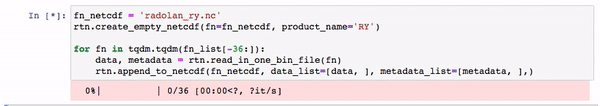

# radolan_to_netcdf

[](https://travis-ci.org/cchwala/radolan_to_netcdf) [](https://codecov.io/gh/cchwala/radolan_to_netcdf) [](https://mybinder.org/v2/gh/cchwala/radolan_to_netcdf/HEAD) [](https://doi.org/10.5281/zenodo.4452204)


A Python package to parse RADOLAN binary data files to NetCDF

## Features

* create CF-conform NetCDFs for RADOLAN data and parse RADOLAN binary files
* write back to RADOLAN-binary format
* supported products:
    * RADOLAN-RW (gauge adjusted hourly rainfall sum)
    * RADOLAN-RY (5-minute unadjusted rainfall sum), [example notebook](notebooks/example_download_and_parse_radolan-ry_data.ipynb) also available on [mybinder](https://mybinder.org/v2/gh/cchwala/radolan_to_netcdf/HEAD?filepath=notebooks%2Fexample_download_and_parse_radolan-ry_data.ipynb)
    * RADKLIM-YW (5-minute rainfall sum with "climatological" corrections), [example notebook](notebooks/example_download_and_parse_radklim-yw_data.ipynb) also available on [mybinder](https://mybinder.org/v2/gh/cchwala/radolan_to_netcdf/HEAD?filepath=notebooks%2Fexample_download_and_parse_radklim-yw_data.ipynb)


## Example usage

Assuming that you have some RADOLAN binary files on your hard drive it only takes some lines of code using `radolan_to_netcdf` to create a [CF-conform](http://cfconventions.org/) NetCDF:

```python
import tqdm
import radolan_to_netcdf as rtn

fn_netcdf = 'radolan_ry.nc'
rtn.create_empty_netcdf(fn=fn_netcdf, product_name='RY')

for fn in tqdm.tqdm(fn_list):
    data, metadata = rtn.read_in_one_bin_file(fn)
    rtn.append_to_netcdf(fn_netcdf, data_list=[data, ], metadata_list=[metadata, ],)
```



For the full example using RADOLAN-RY data (5-minute radar rainfall composite for Germany), see the notebook [here](notebooks/example_download_and_parse_radolan-ry_data.ipynb) or open it on [mybinder](https://mybinder.org/v2/gh/cchwala/radolan_to_netcdf/HEAD?filepath=notebooks%2Fexample_download_and_parse_radolan-ry_data.ipynb)

The content of the created NetCDF can easily be plotted on a dynamic map thanks to [`xarray`](http://xarray.pydata.org) and [`hvplot`](https://hvplot.holoviz.org/) with a time-slider:

```python
import xarray as xr
import hvplot.xarray

ds = xr.open_dataset(fn_netcdf)
plot = ds.rainfall_amount.hvplot.quadmesh(
    x='longitudes', 
    y='latitudes',
    frame_width=500, 
    rasterize=True,
    tiles='ESRI', 
    project=True, 
    geo=True, 
    clim=(0.1, 2), 
    cmap='rainbow', 
    clabel='rainfall amount (mm)')

plot.opts('Image', clipping_colors={'min': 'transparent', 'NaN': 'gray'}, alpha=0.5, toolbar='above')
```


## Credits

* Parsing the RADOLAN binary files is done using [`wradlib`](https://wradlib.org/).
* The [RADOLAN radar products](https://www.dwd.de/DE/leistungen/radolan/radolan_info/radolan_poster_201711_en_pdf.pdf;jsessionid=4E56FC617A4463815FE89E1247830E81.live11042?__blob=publicationFile&v=2) are produced by the [German Meteorological Service (DWD)](https://www.dwd.de).  Many of these products are openly available at https://opendata.dwd.de/.
* This package was created with [Cookiecutter](https://github.com/audreyr/cookiecutter) and the [audreyr/cookiecutter-pypackage](https://github.com/audreyr/cookiecutter-pypackage) project template.

